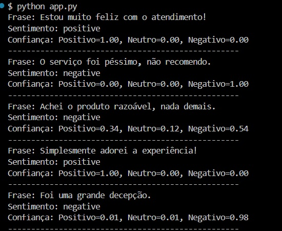

# 🧠 Análise de Sentimentos com Azure AI e Python

Este projeto demonstra como realizar uma análise de sentimentos utilizando o serviço **Azure AI Language Studio** e um script em **Python**. Ele faz parte de um desafio prático da DIO e foi criado para ajudar a construir um portfólio técnico sólido. 💪

## 🚀 Como funciona

1. Você escreve frases no arquivo `inputs/frases.txt`.
2. O Python lê essas frases.
3. As frases são enviadas para o serviço de Análise de Sentimentos da Azure.
4. O resultado classifica as frases como **positiva**, **negativa** ou **neutra**.

## 🧪 Exemplo de entrada

Conteúdo de `inputs/frases.txt`:

Estou muito feliz hoje! O produto chegou quebrado. A experiência foi ok, nada demais.


## 📊 Resultado da análise (exemplo)

Frase: Estou muito feliz hoje! → Sentimento: positivo Frase: O produto chegou quebrado. → Sentimento: negativo Frase: A experiência foi ok, nada demais. → Sentimento: neutro

bash
Copiar
Editar


## 🧰 Tecnologias utilizadas

- Python 3.10+
- Azure AI Language (Cognitive Services)
- Requests

## 🧭 Como rodar o projeto

### 1. Clone o repositório

```bash
git clone https://github.com/seu-usuario/analise-sentimentos.git
cd analise-sentimentos

2. Instale as dependências

pip install -r requirements.txt


3. Configure as variáveis de ambiente (no próprio script app.py ou usando dotenv)

AZURE_ENDPOINT

AZURE_KEY

4. Execute

python app.py


## 🖼 Prints do Projeto

### Resultado no terminal:


[[](https://colab.research.google.com/github/sandramastrogiacomo/analise-sentimentos-azure-a/blob/main/analise_sentimento.ipynb)


💡 Aprendizados e possibilidades

Como consumir uma API da Azure

Aplicações práticas de IA no dia a dia

Como estruturar projetos para portfólio

Boas práticas com Python e GitHub


✨ Possíveis melhorias

Interface Web com Streamlit

Classificação por emoção (além de sentimento)

Exportar resultados para CSV ou Excel

📎 Licença

Projeto de uso livre para fins de aprendizado. Feito com ♥ por Sandra Mastrogiacomo.


---

## ✅ `requirements.txt`

Crie esse arquivo também na raiz do projeto, com o seguinte conteúdo:

```txt
requests
python-dotenv

Se não usar .env, pode remover o python-dotenv.
